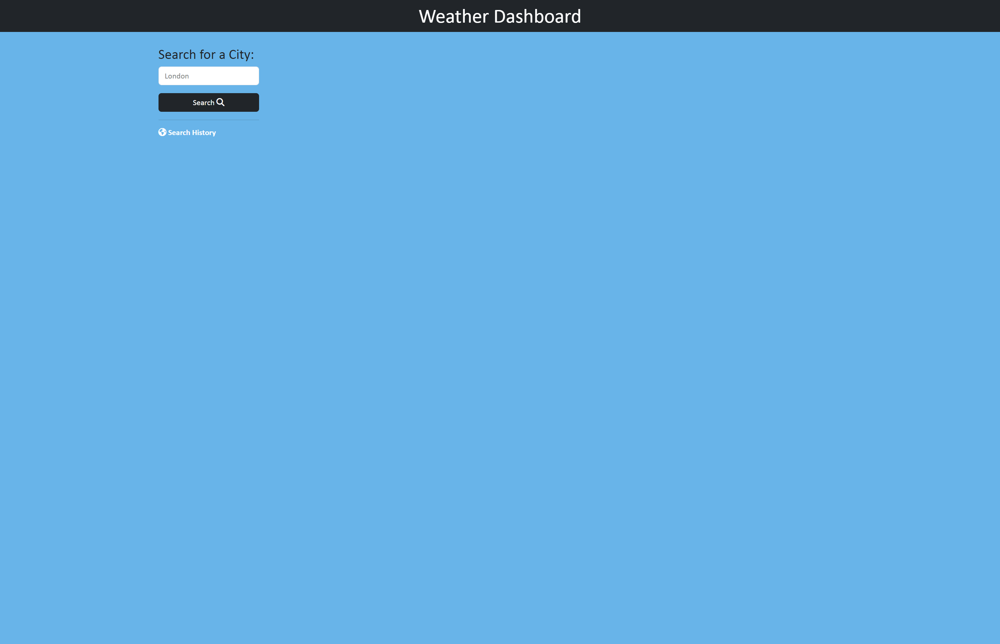
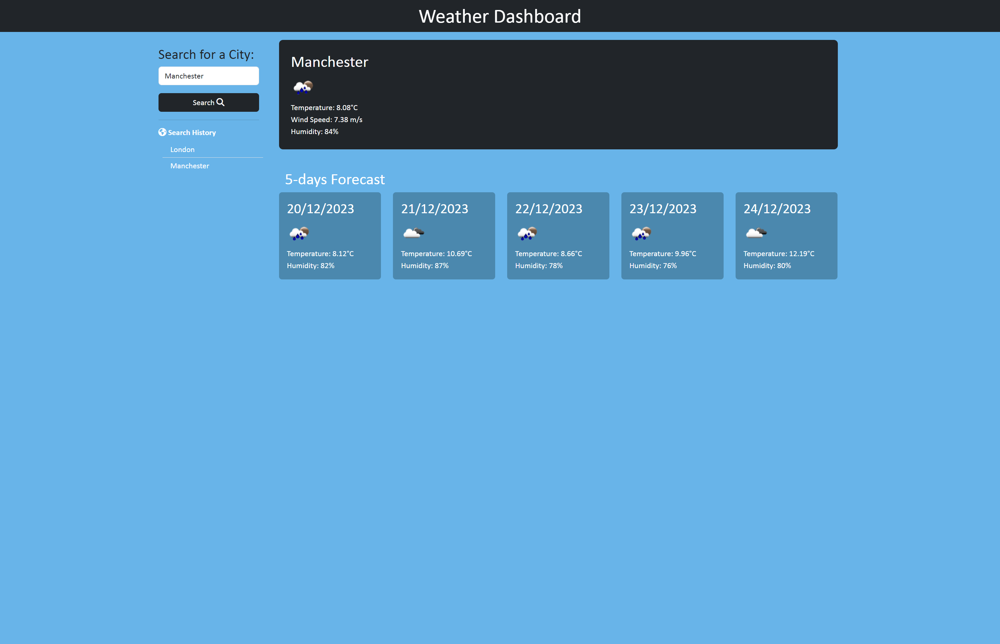
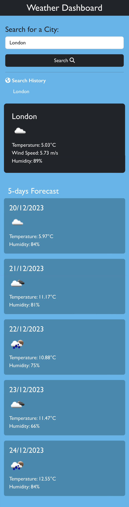

# W8-SimpleWeatherDashboard

## Description
The Weather Dashboard is a tool for tracking weather forecasts. It uses the OpenWeatherMap API to fetch weather data based on user input. Users can quickly access the latest weather information and forecasts for different locations. The application also includes a built-in search history that is stored in local storage.

## Folder Structure

- **index.html**: The Main HTML file for this scheduler.
- **assets:** includes 2 subfolders for styles (css) and  JavaScript.
  - **css:** 2 files, styles.css for styling, reset.css for to standardize and remove default styling applied by browsers to HTML elements.
  - **js:** JavaScript file for the application
- **screencaptures:** includes 3 screenshot images.
  - **screencapture-W8-SimpleWeatherDashboard-1.png:** Screenshot for the html.
  - **screencapture-W8-SimpleWeatherDashboard-2.png:** Screenshot after searching.
  - **screencapture-W8-SimpleWeatherDashboard-3.png:** Mobile version.
- **README.md:** This file.

## Links

[Visit my application](https://celia103.github.io/W8-SimpleWeatherDashboard/)

[Visit the GitHub repository](https://github.com/celia103/W8-SimpleWeatherDashboard)

- Application Screenshot:

- Screenshot after search:

- mobile Screenshot:

## License

MIT License
